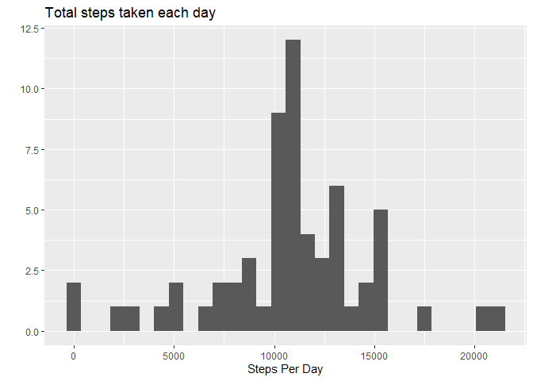

## Loading and preprocessing the data

First I have to unzip and read the data into R. I'll use the functions `unzip()` and `read.csv()` to do that.


```r
## reading data
unzip("activity.zip")
activityRaw <- read.csv("activity.csv", header=TRUE)

## first six rows 
head(activityRaw)
```

```
##   steps       date interval
## 1    NA 2012-10-01        0
## 2    NA 2012-10-01        5
## 3    NA 2012-10-01       10
## 4    NA 2012-10-01       15
## 5    NA 2012-10-01       20
## 6    NA 2012-10-01       25
```

Let's check the class of the data in our dataframe.


```r
## checking the classes
sapply(activityRaw, class)
```

```
##       steps        date    interval 
##   "integer" "character"   "integer"
```

## What is mean total number of steps taken per day?

Let's calculate the total number of steps per day.


```r
## toal number of steps per day
stepsPerDay <- tapply(activityRaw$steps, activityRaw$date, sum, na.rm=TRUE)
stepsPerDay
```

```
## 2012-10-01 2012-10-02 2012-10-03 2012-10-04 2012-10-05 2012-10-06 2012-10-07 
##          0        126      11352      12116      13294      15420      11015 
## 2012-10-08 2012-10-09 2012-10-10 2012-10-11 2012-10-12 2012-10-13 2012-10-14 
##          0      12811       9900      10304      17382      12426      15098 
## 2012-10-15 2012-10-16 2012-10-17 2012-10-18 2012-10-19 2012-10-20 2012-10-21 
##      10139      15084      13452      10056      11829      10395       8821 
## 2012-10-22 2012-10-23 2012-10-24 2012-10-25 2012-10-26 2012-10-27 2012-10-28 
##      13460       8918       8355       2492       6778      10119      11458 
## 2012-10-29 2012-10-30 2012-10-31 2012-11-01 2012-11-02 2012-11-03 2012-11-04 
##       5018       9819      15414          0      10600      10571          0 
## 2012-11-05 2012-11-06 2012-11-07 2012-11-08 2012-11-09 2012-11-10 2012-11-11 
##      10439       8334      12883       3219          0          0      12608 
## 2012-11-12 2012-11-13 2012-11-14 2012-11-15 2012-11-16 2012-11-17 2012-11-18 
##      10765       7336          0         41       5441      14339      15110 
## 2012-11-19 2012-11-20 2012-11-21 2012-11-22 2012-11-23 2012-11-24 2012-11-25 
##       8841       4472      12787      20427      21194      14478      11834 
## 2012-11-26 2012-11-27 2012-11-28 2012-11-29 2012-11-30 
##      11162      13646      10183       7047          0
```

Histogram of the total number of steps taken each day:


```r
## plotting the histogram
library(ggplot2)
qplot(stepsPerDay, xlab = "Steps Per Day", main="Total steps taken each day", fill="red")
```

```
## `stat_bin()` using `bins = 30`. Pick better value with `binwidth`.
```

<!-- -->

Mean and median of the total number of steps per day

```r
## mean of the total number of steps
paste("The mean of the total number of steps taken per day is: ", round(mean(stepsPerDay), 2))
```

```
## [1] "The mean of the total number of steps taken per day is:  9354.23"
```

```r
## median of the total number of steps
paste("The median of the total number of steps taken per day is: ", round(median(stepsPerDay), 2))
```

```
## [1] "The median of the total number of steps taken per day is:  10395"
```


## What is the average daily activity pattern?


```r
## let's calculate the average number of steps per day
AvgStepsPerDay <- tapply(activityRaw$steps, activityRaw$interval, mean, na.rm=TRUE)


## plotting against the 5-minutes interval column
plot(unique(activityRaw$interval), AvgStepsPerDay, 
     type="l", 
     xlab="5-minute interval", 
     ylab="Average number of Steps",
     main="5-minute Interval vs Steps per day")
```

<!-- -->
Now let's check for the 5-minute interval with the maximum number of steps. 


```r
## let's find the index
maxIndex <- which(AvgStepsPerDay %in% max(AvgStepsPerDay))

## Let see the 5-minute interval
unique(activityRaw$interval)[maxIndex]
```

```
## [1] 835
```
So, the 5-minute interval, on average across all the days in the dataset, that contains the maximum number of steps is the **835**.


## Imputing missing values

1. Calculating the number of rows with missing values.


```r
## the complete.cases function allows us to calculate the rows without missing values. 
## I will used it to count them and then take the difference with the tota number of rows. 

## complete cases
NoNas <- complete.cases(activityRaw)

## Missing values
Nas <- dim(activityRaw)[1]-sum(NoNas)
paste("The total number of rows with missing values is:", Nas)
```

```
## [1] "The total number of rows with missing values is: 2304"
```
Now let's check the number of Na's by column.


```r
## Nas
sum(is.na(activityRaw$steps))
```

```
## [1] 2304
```

```r
sum(is.na(activityRaw$date))
```

```
## [1] 0
```

```r
sum(is.na(activityRaw$interval))
```

```
## [1] 0
```

2. Now let's fill he Na values.


```r
## calculating the mean for the interval
meanByInterval <- tapply(activityRaw$steps, activityRaw$interval, mean, na.rm=TRUE)

## Vector with the unique valur of the intervals
intervals <- unique(activityRaw$interval)

## dataframe 2
df2 <- activityRaw[,c("steps", "interval")]
```


```r
## function for filling the NA's

for (i in 1:dim(df2)[1]) {
    position <- which(intervals %in% df2$interval[i])  ## getting the position of the interval
    
    if (is.na(df2$steps[i])==TRUE){
    df2$steps2[i] <- meanByInterval[position]          ## assigning the mean steps corresponding to that interval
    } else {
    df2$steps2[i] <- df2$steps[i]                      
    }

}

head(df2)
```

```
##   steps interval    steps2
## 1    NA        0 1.7169811
## 2    NA        5 0.3396226
## 3    NA       10 0.1320755
## 4    NA       15 0.1509434
## 5    NA       20 0.0754717
## 6    NA       25 2.0943396
```

3. Now let's build a new dataframe.


```r
## New Data Frame
ActivityClean <- data.frame("steps"=df2$steps2, "date"=activityRaw$date, "interval"=activityRaw$interval)
head(ActivityClean)
```

```
##       steps       date interval
## 1 1.7169811 2012-10-01        0
## 2 0.3396226 2012-10-01        5
## 3 0.1320755 2012-10-01       10
## 4 0.1509434 2012-10-01       15
## 5 0.0754717 2012-10-01       20
## 6 2.0943396 2012-10-01       25
```


```r
## checking missing values
sum(is.na(ActivityClean$steps))
```

```
## [1] 0
```

4. Making a histogram and calculating the mean and median


```r
## total number of steps per day
stepsPerDay2 <- tapply(ActivityClean$steps, ActivityClean$date, sum)

## plotting the histogram
qplot(stepsPerDay2, xlab = "Steps Per Day", main="Total steps taken each day")
```

```
## `stat_bin()` using `bins = 30`. Pick better value with `binwidth`.
```

<!-- -->

Mean and median of the total number of steps per day

```r
## mean of the total number of steps
paste("The mean of the total number of steps taken per day is: ", round(mean(stepsPerDay2), 2))
```

```
## [1] "The mean of the total number of steps taken per day is:  10766.19"
```

```r
## median of the total number of steps
paste("The median of the total number of steps taken per day is: ", round(median(stepsPerDay2), 2))
```

```
## [1] "The median of the total number of steps taken per day is:  10766.19"
```

In this case, the mean and median value are equal and different from the ones calculates in the first part of the assignment.

Imputing missing values makes the mean and median to increase. 


## Are there differences in activity patterns between weekdays and weekends?

First, let's convert the column date to a datetime and then we could get the weekdays.


```r
## Converting
ActivityClean$date <- as.Date(ActivityClean$date, format = "%Y-%m-%d")

## creating the new factor variable
## My computer language is in spanish
ActivityClean$dayOfWeek <- ifelse(weekdays(ActivityClean$date)==c("sábado", "domingo"), "weekend", "weekday")

## conveting it to a factor
ActivityClean$dayOfWeek <- as.factor(ActivityClean$dayOfWeek)

## first rows
head(ActivityClean)
```

```
##       steps       date interval dayOfWeek
## 1 1.7169811 2012-10-01        0   weekday
## 2 0.3396226 2012-10-01        5   weekday
## 3 0.1320755 2012-10-01       10   weekday
## 4 0.1509434 2012-10-01       15   weekday
## 5 0.0754717 2012-10-01       20   weekday
## 6 2.0943396 2012-10-01       25   weekday
```

Making the panel plot.


```r
library(lattice)

## steps per day
stepsPerDay2 <- tapply(ActivityClean$steps, ActivityClean$interval, mean)

## intervals
intervals <- unique(ActivityClean$interval)

## days
datesData <- unique(ActivityClean$date)

## dayOfWeek
dayOfWeek <- ifelse(weekdays(datesData)==c("sábado", "domingo"), "weekend", "weekday")
```

```
## Warning in weekdays(datesData) == c("sábado", "domingo"): longer object length
## is not a multiple of shorter object length
```

```r
dayOfWeek <- as.factor(dayOfWeek)

## plotting
xyplot(stepsPerDay2~intervals|dayOfWeek, type="l", layout=c(1,2))
```

<!-- -->

